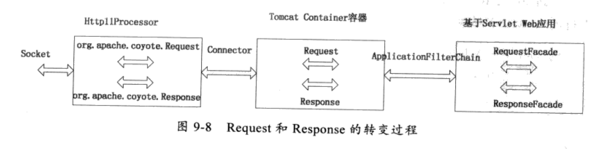
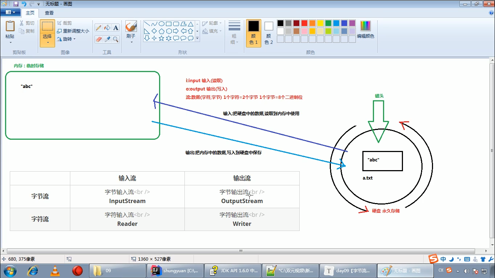
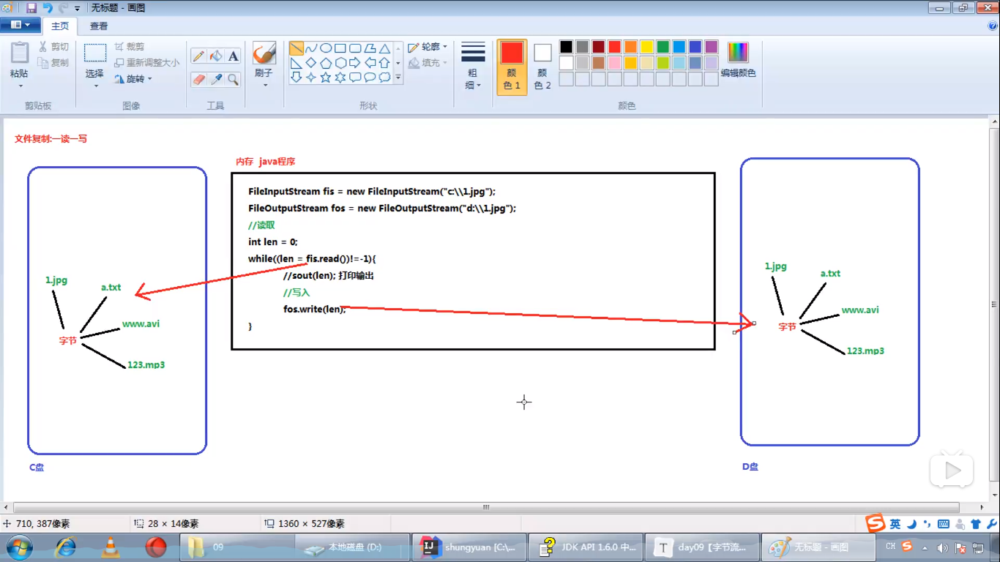
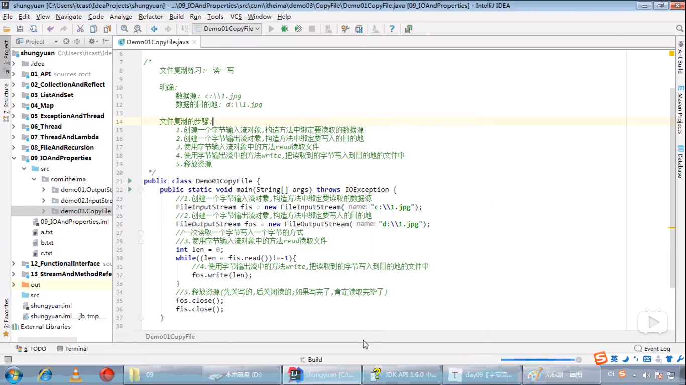
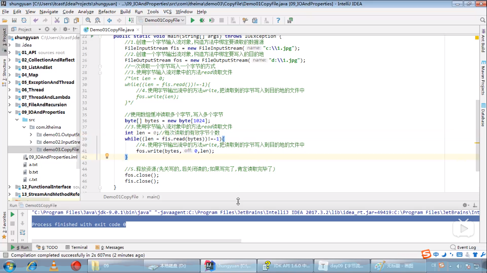

# 小郑同学的代码学习日志

### 一.关于反射的问题

[file reference]: https://www.bilibili.com/video/BV1C4411373T

[关于引用源头](https://www.bilibili.com/video/BV1C4411373T)

#### 反射原理建模

关于前置背景说明：

代码运行过程中会有三个阶段1. Source 源码阶段	2. Class类对象阶段	3. Runtime运行时阶段

架构模型


原理：在源码阶段获得Class对象的操作叫做反射

> 将类的各个组成部分封装成其他对象，这就是反射机制

由于对应三个阶段，分别有三种反射应用的方法

1. Source 阶段 代码：Class.forName("全类名")：将字节码文件加载进内存，返回Class对象。
   * 多用于配置文件，将类名定义在配置文件中。读取文件，加载类（见jdbc连接的时候）

2. Class对象阶段  代码：类名.class：通过类名的属性class获取
   * 多用于参数的传递

3. Runtime阶段 代码：对象.getClass()：getClass()方法在Object类中定义着
   * 多用于对象获取字节码的方式

* 注意：同一个字节码文件（*.class）在一次程序运行过程中，只会被加载一次，无论哪种方式获取的Class对象都是同一个。

#### 关于反射在程序中的应用

反射是框架设计的灵魂和基础，也可以对文件进行解耦

### 二，关于注解

[file references](https://www.bilibili.com/video/BV1Vt411g7RP)

#### 注释是个什么东西

* 本质：其是给电脑看的注解：

* 关于实现：表面上是看是 @注解名字 之类的，其实在反编译之后就可以看见其本质上是一种接口，继承于-Java.lang.annottion接口

> 定义：注解（annotation)，也叫元数据。一种代码级别的说明。它是JDK1.5之后引入的一个特性与类，接口，枚举是在同一个层次，它可以声明在包，类，字段，方法，局部变量，方法参数的前面，用来对这些元素进行说明，注释。

* 自定义注解的格式：

  public	@interface	注解名称{	}

  * 其中可以定义接口定义的东西
  * 属性：接口中的抽象方法（不加抽象的关键字）
    * 其中的属性赋值格式@注解名称（属性1="值1",属性2="值2"）
    * 特殊属性名value ，可以不用赋值格式。即@注解名（”值“）==@注解名（value=”值“）

#### 注解它有个什么用呢

* 三个作用
  1. 编写文档：通过注解里标识的注解生成说明文档（生成doc文档）
  2. 代码分析：通过代码里标识的注解对代码进行分析（使用反射）
  3. 编译检查：通过代码里标识的注解让编译器能够实现基本的编译检查（@Override）

* 一些例子

  * JDK预定义的一部分

    * @Override：检测该继承父类的方法是否来自父类（一般用于重写方法）
    * @Deprecated：该注解被标注的内容表示已过时，(使用该方法时会出现~~删除线~~)
    * @SuppressWarnings：压制警告（一般传参“all”表示压制目录下所有，@SuppressWarnings（“all”））

  * 关于spring框架使用的注解

    [reference](https://www.cnblogs.com/xiaoxi/p/5935009.html)

    * bean的装配：1. @Aotowired	配合@Qualifier	2. @Resource

    * 在spring配置文件下配合扫描来注册

      1. @Compenent

      2. @Controller：对应表现层的bean

      3. @Service：对应服务层的bean

      4. @Repository：对应数据访问层 的bean
         * 关于接口的概念的接口@RequestMapping（"/路径"）

      

> **使用注解来构造IoC容器**
> **用注解来向Spring容器注册Bean。需要在applicationContext.xml中注册。**

### 三，关于ssm框架集成的配置


1. web.xml

```xml
<?xml version="1.0" encoding="UTF-8"?>
<web-app xmlns:xsi="http://www.w3.org/2001/XMLSchema-instance" 
xmlns="http://xmlns.jcp.org/xml/ns/javaee" 
xsi:schemaLocation="http://xmlns.jcp.org/xml/ns/javaee http://xmlns.jcp.org/xml/ns/javaee/web-app_4_0.xsd"
 id="WebApp_ID" version="4.0">
  <display-name>ssm_dome</display-name>
  
  <filter>
		<filter-name>encodingFilter</filter-name>
		<filter-class>org.springframework.web.filter.CharacterEncodingFilter</filter-class>
		<init-param>
			<param-name>encoding</param-name>
			<param-value>UTF-8</param-value>
		</init-param>
		<init-param>
			<param-name>forceEncoding</param-name>
			<param-value>true</param-value>
		</init-param>
	</filter>
	<filter-mapping>
		<filter-name>encodingFilter</filter-name>
		<url-pattern>/*</url-pattern>
	</filter-mapping>
  
  <servlet>
		<servlet-name>springMvc</servlet-name>
		<servlet-class>org.springframework.web.servlet.DispatcherServlet</servlet-class>
		<init-param>
			<param-name>contextConfigLocation</param-name>
			<param-value>classpath:spring-mvc.xml</param-value>
		</init-param>
		<load-on-startup>1</load-on-startup>
	</servlet>
	<servlet-mapping>
		<servlet-name>springMvc</servlet-name>
		<url-pattern>/</url-pattern>
	</servlet-mapping>
  
	 <context-param>
		<param-name>contextConfigLocation</param-name>
		<param-value>classpath:applicationContext.xml</param-value>
	</context-param>
	
	<listener>
		<listener-class>org.springframework.web.context.ContextLoaderListener</listener-class>
	</listener>
  
  
    <welcome-file-list>
    	<welcome-file>index.jsp</welcome-file>
 	</welcome-file-list>
  
</web-app>
```

2. spring—mvc.xml

```xml
<?xml version="1.0" encoding="UTF-8"?>
<beans xmlns="http://www.springframework.org/schema/beans"
xmlns:xsi="http://www.w3.org/2001/XMLSchema-instance"
xmlns:context="http://www.springframework.org/schema/context"
xmlns:mvc="http://www.springframework.org/schema/mvc"
xsi:schemaLocation="http://www.springframework.org/schema/beans http://www.springframework.org/schema/beans/spring-beans.xsd
http://www.springframework.org/schema/context http://www.springframework.org/schema/context/spring-context.xsd
http://www.springframework.org/schema/mvc http://www.springframework.org/schema/mvc/spring-mvc.xsd">
<!-- 文件体在这里 -->
<!-- 扫描所有控制器 -->
	<!-- <context:component-scan base-package="./concrollers"></context:component-scan> -->
	<context:component-scan base-package="com.controller"></context:component-scan>
	  
	<mvc:annotation-driven />
	
	<bean class="org.springframework.web.servlet.view.InternalResourceViewResolver"
		id="internalResourceViewResolver">
		<property name="prefix" value="/WEB-INF/jsp/"></property>
		<property name="suffix" value=".jsp"></property>
	</bean>
	
	<!-- 配置 MultipartResolver -->
	<bean id="multipartResolver"
	class="org.springframework.web.multipart.commons.CommonsMultipartResolver">
		<property name="defaultEncoding" value="UTF-8"></property>
	</bean>
	
	
	<!-- 对静态资源文件的访问 -->      
	
	
	<mvc:default-servlet-handler/>
	
	
</beans>

```

3. applicationContext.xml

```xml
<?xml version="1.0" encoding="UTF-8"?>
<!-- <!DOCTYPE beans PUBLIC "-//SPRING/DTD BEAN/EN" 
"http://www.springframework.org/dtd/spring-beans.dtd"> -->
<beans xmlns="http://www.springframework.org/schema/beans"
	xmlns:xsi="http://www.w3.org/2001/XMLSchema-instance"
	xmlns:aop="http://www.springframework.org/schema/aop" 
	xmlns:context="http://www.springframework.org/schema/context"
	xmlns:tx="http://www.springframework.org/schema/tx"
	xsi:schemaLocation="http://www.springframework.org/schema/beans
		http://www.springframework.org/schema/beans/spring-beans.xsd
		http://www.springframework.org/schema/aop
		http://www.springframework.org/schema/aop/spring-aop.xsd
		http://www.springframework.org/schema/context
		http://www.springframework.org/schema/context/spring-context.xsd
		http://www.springframework.org/schema/tx
		http://www.springframework.org/schema/tx/spring-tx.xsd" >
	<!-- 文件体写在这里 -->
	
	<!-- 引入配置文件 -->
	<bean id="propertyConfigurer"
		class="org.springframework.beans.factory.config.PropertyPlaceholderConfigurer">
		<property name="location" value="classpath:jdbc.properties" />
	</bean>
	
	<!-- <context:property-placeholder location="classpath:jdbc.properties"/> -->
	
	<bean id="dataSource" class="org.apache.commons.dbcp2.BasicDataSource"	destroy-method="close">
		<property name="driverClassName" value="${jdbc.driver}" />
		<property name="url" value="${jdbc.url}" />
		<property name="username" value="${jdbc.username}" />
		<property name="password" value="${jdbc.password}" />
		<!-- 事务是否自动提交 -->
		<property name="defaultAutoCommit" value="${defaultAutoCommit}"></property>
	</bean>
		
	<bean id="sqlSessionFactory" class="org.mybatis.spring.SqlSessionFactoryBean">
		<property name="dataSource" ref="dataSource" />
		<!-- 自动扫描mapping.xml文件 -->
		<property name="mapperLocations" value="classpath:mapper/*.xml"></property>
	</bean>
	
	<bean id="sqlSessionTemplate" class="org.mybatis.spring.SqlSessionTemplate">
		<constructor-arg ref="sqlSessionFactory" />
	</bean>
	
	<bean id="login" class="com.service.Login" >
		<property name="sqlSession" ref="sqlSessionTemplate"/>
	</bean>


</beans>
```

4. UserMapper.xml

```xml
<?xml version="1.0" encoding="UTF-8"?>
<!DOCTYPE mapper
PUBLIC "-//mybatis.org//DTD Mapper 3.0//EN"
"http://mybatis.org/dtd/mybatis-3-mapper.dtd">

<mapper namespace="/">
<!-- <mapper namespace="mapper.UserMapper"> -->

	<resultMap type="com.model.User" id="user">
	  <id property="userid" column="teacherId"/>
	  <result property="username" column="name"/>
	  <result property="password" column="password"/>
	</resultMap>

	<select id="getUser" parameterType="com.model.User" resultMap="user">
		SELECT * FROM teachers where name=#{username} and password=#{password}
	</select>
	
</mapper>

```

### 四，关于文件操作的专项研究

#### 关于`/upload_submit`延伸到ServletContext与文件相对路径

```java
package com.controller;

import java.io.File;
import java.io.IOException;

import javax.servlet.http.HttpServletRequest;

import org.springframework.stereotype.Controller;
import org.springframework.web.bind.annotation.RequestMapping;
import org.springframework.web.bind.annotation.RequestParam;
import org.springframework.web.multipart.MultipartFile;
import org.springframework.web.servlet.ModelAndView;

@Controller
public class UploadController {

	@RequestMapping("/upload")
	public String upload() {
		return "upload";
	}
	
	@RequestMapping("/upload_submit")
	public ModelAndView submit(HttpServletRequest request,@RequestParam("file") MultipartFile file )
			throws IOException {
			//获取文件名
				String filename = file.getOriginalFilename();
				//获取文件保存到服务器上的地址
				String path = request.getServletContext().getRealPath("/upload/")+ filename;
				File f = new File(path);
				//判断upload文件夹是否存在，如果不存在则创建
				if(!f.getParentFile().exists()){
					f.getParentFile().mkdirs();
				}
				//将上传的文件传输到指定路径
				file.transferTo(f);

				//返回视图
				ModelAndView mv = new ModelAndView("upload_succ");
				mv.addObject("filename", filename);//将文件名传递到下一个页面
				//将下载该文件的url传递到前台
				String uripath="/ssm_demo/upload/"+filename;
				mv.addObject("uripath", uripath);
		return mv;
	}
}

```

##### 关于request的相关原理

[refer](https://www.bilibili.com/video/BV1J4411877m?p=240)

###### 体系架构

* 来源：在servlet的service()方法中有两个参数，分别为?ServletRquest和ServletResponse.

  * 其来源于apache的tomcat中的类，运行过程中也由tomcat（服务器）来创建

  * 体系架构：servletRequest（接口）---继承--> HttpServletRequest（接口）

    ---实现-->org.apache.catalina.connector.RequestFacade（类）
  
  
* 内部内容：封装了请求数据消息（http数据报）
  
    * 1. 请求行：方法（get/post）	URL(/login.html)	版本(HTTP/1.1)
       相关方法：[refer](https://www.bilibili.com/video/BV1J4411877m?p=242)
    
         
       **关于其中重点掌握的方法**
    
         * 2. 获取虚拟目录：	String getContextPath();
       * 5. 获取请求URI：	String getRequestURI();	
    
      2. 请求头：（请求头名：请求头值）*n，中间空格隔开
         相关方法：[refer](https://www.bilibili.com/video/BV1J4411877m?p=244)
         
       **其中重点掌握**
    
       * String getHeader("name");根据请求头来获取值	[使用](./img/request.getHeader()的使用.png)例子
    
         注意上面那个Enumeration<String>	[document](./jdk+api+1.8.CHM)来查找 [使用](./request.getHeader()的使用.png)
    
    3. 请求空行：其实就是空行
    
      4. 请求体：在post请求方法中来放参数，get请求方法中不用（放url上）
          
    
         * **重点例子**：BufferReader	detReader():	[example](./img/request.getReader()实例)	
           * 其中Buffer Reader类具体参考帮助文档	[docement](./jdk+api+1.8.CHM)

###### 关于重要的功能

* 获取请求参数通用方式
  1. String getParameter(String name):根据参数名获取数据 (username=xx&password=yy)
  2. String getParameterValues(Sring name):根据参数名称获取参数值的数组 （hobby=xx&hobby=yy)
  3. Enumeration<String> getParameterNames():获取所有请求的参数名称
     * 关于Enumeration请向上查找
  4. Map<String,String[]> getParameterMap():获取所有参数的map集合
     * map[的使用](.img/map集合的过场.png)	[帮助文档](./jdk+api+1.8.CHM)	**Set<String> keyset=Map.keySet()**(map的两种遍历方法之一[link](https://blog.csdn.net/BestEternity/article/details/89137921))
  5. 关于乱码的问题：get方式：tomcat 8已经将get方式乱码问题解决了
     post方式：会乱码
     * 解决：在获取参数前，设置request的编码	request.setCharacterEncoding("utf-8");
  
* 请求转发：一种在服务器内部完成资源跳转的方式

  * 步骤：

    * 1. 通过request对象获取请求转发器对象：
         RequestDispatcher	getRequestDispatcher(String path)
      2. 之后，使用RequestDispatcher对象来进行转发：[关于类](.\img\RequestDispatcher类对象)
         forward(ServletRequset request,ServletResponse response)

    * 小小题外话：**关于链式编程**：创建一个变量太浪费，将上面两行合起来
      

      ```java
      RequestDispatcher requestDispatcher=request.getRequestDispatcher("/requestDemo9");
      requestDispatcher.dorword(request,response);
      //等价于下面的代码
      Request.getRequestDispatcher("/requestDemo9").forward(request,response);
      ```

  * 特点：[refer](https://www.bilibili.com/video/BV1J4411877m?p=249)

    * 1. 浏览器地址路径不发生变化
      2. 只能转发到当前服务器内部资源中
      3. 该转发只能算是同一次请求

* 共享数据：

  * 域对象：一个有作用范围的对象，可以在范围内共享数据(一个请求的开始出现，结束消失)
  * request域：代表一次请求的范围，一般用于请求转发的多个资源中共享数据
  * 方法：
    * 1. void	setAttribute(String name,Object obj):存储数据
      2. Object getAttribute(String name):通过键获取值
      3. void removeAttribute(String name):通过键移除键值对

* 获取ServletContext

  * `ServletContext getServletContext();`(在ServletRequest中获取)

    * 关于ServleContext 	[API](https://docs.oracle.com/javaee/6/api/javax/servlet/ServletContext.html)	（向下看看）

      

###### 关于ServletContext（其并不属于Request范围内）

* [API](https://docs.oracle.com/javaee/6/api/javax/servlet/ServletContext.html)

* 概念：代表整个web应用，可以和程序的容器（服务器）来通信

* 获取方式

  * 通过request对象的`.getServletContext();`来进行获取
  * 通过HttpServlet的`.getServletContext();`来进行获取
    * 其使用时用`this.getServletContext();`来使用（因为在我们使用的Servlet都会继承HttpServlet的该方法）[实例](./img/ServletContext对象的获取.png)

* 功能：

  * 获取MIME对象
    * MIME类型：在互联网通信过程中定义的一种文件格式
      * 格式：大类型/小类型	例子：text/html	image/jpeg
    * 获取：String getMimeType(String file)
  * 域对象：共享数据：（其服务器开启被创建，结束被销毁。所以一般不用这个功能，因为会给存多了会给服务器带来压力）
    * void	setAttribute(String name,Object obj):存储数据
    * Object getAttribute(String name):通过键获取值
    * void removeAttribute(String name):通过键移除键值对
    * ServletContext对象范围：所有用户请求的数据
  * **获取文件的真实（服务器）路径**
    * 方法：String	getRealPath(String name);
      * **基础小知识**：关于各个文件夹下的关系	[example](./img/关于程序下资源路径关系.png)
        * web下资源相对路径为（"/b.txt"）
        * WEB-INF目录下资源相对路径("/WEB-INF/c.txt")
        * src目录下资源访问相对路径("/WEB-INF/classes/a.txt")

* > ## （javax.servlet） Interface ServletContext
  >
  > 定义一组servlet用于与其servlet容器进行通信的方法，例如，获取文件的MIME类型，调度请求或写入日志文件。
  >
  > 每个Java虚拟机的每个“ Web应用程序”都有一个上下文。（“ Web应用程序”是Servlet和内容的集合，这些Servlet和内容安装在服务器URL命名空间的特定子集下，例如`/catalog` 并可能通过`.war`文件安装。）
  >
  > 如果Web应用程序的部署描述符中标记为“ distributed”，则每个虚拟机都有一个上下文实例。在这种情况下，上下文不能用作共享全局信息的位置（因为信息不会真正是全局的）。请改用外部资源，例如数据库。
  >
  > 该`ServletContext`对象包含在`ServletConfig`对象中，当初始化Servlet时，Web服务器将为该对象提供Servlet。

* `String servletcontext.getRealPath(String path);`:**获取与给定*虚拟*路径相对应 的*真实*路径。**

  * > 例如，如果`path`等于`/index.html`，则此方法将返回服务器文件系统上的绝对文件路径，该文件的格式为 `http：// ： /  / index。 html` 将被映射，其中``对应于此ServletContext的上下文路径。
    >
    > 返回的实际路径将采用适合运行servlet容器的计算机和操作系统的形式，包括适当的路径分隔符。
    >
    > 仅当容器已将其从其包含的JAR文件中解压缩时，才必须考虑 应用程序的`/ WEB-INF / lib`目录中捆绑的JAR文件的`/ META-INF / resources`目录 内的`资源`，在这种情况下，必须指向解压缩位置的路径被退回。``
    >
    > `null`如果Servlet容器无法将给定的*虚拟*路径转换为 *真实*路径，则返回此方法。
    >
    > 
    >
    > - **参数：**
    >
    >   `path`- 要转换为 *真实*路径的*虚拟*路径
    >
    > - **返回值：**
    >
    >   在*真正的*路径，或`空`，如果不能进行翻译

* > 添加：ServletContext是一个接口，他的实现类是由tomcat创建的。
  >
  > ServletContext:代表的是整个应用。一个应用只有一个ServletContext对象。是单实例。
  > [root](https://www.cnblogs.com/volvane/articles/9273591.html)

##### 关于`@RequestParam()`

* [reference](https://blog.csdn.net/walkerJong/article/details/7946109)

* 其注解家族：

  > 简介：
  > handler method 参数绑定常用的注解,我们根据他们处理的Request的不同内容部分分为四类：（主要讲解常用类型）
  >
  > A、处理requet uri 部分（这里指uri template中variable，不含queryString部分）的注解：   @PathVariable;
  >
  > B、处理request header部分的注解：   @RequestHeader, @CookieValue;
  >
  > C、处理request body部分的注解：@RequestParam,  @RequestBody;
  >
  > D、处理attribute类型是注解： @SessionAttributes, @ModelAttribute;
  > ————————————————
  > 版权声明：本文为CSDN博主「walkerJong」的原创文章，遵循CC 4.0 BY-SA版权协议，转载请附上原文出处链接及本声明。
  > 原文链接：https://blog.csdn.net/walkerJong/article/details/7946109

* `@RequestParam`

  A） 常用来处理简单类型的绑定，通过`Request.getParameter()` 获取的String可直接转换为简单类型的情况（ String--> 简单类型的转换操作由ConversionService配置的转换器来完成）；因为使用request.getParameter()方式获取参数，所以可以处理get 方式中queryString的值，**也可以处理post方式中 body data的值**；

  B）用来处理Content-Type: 为 application/x-www-form-urlencoded编码的内容，提交方式GET、POST；

  C) 该注解有两个属性： value、required； value用来指定要传入值的id名称，required用来指示参数是否必须绑定；

  示例代码：

  ```java
  @Controller
  @RequestMapping("/pets")
  @SessionAttributes("pet")
  public class EditPetForm {
   
      // ...
   
      @RequestMapping(method = RequestMethod.GET)
      public String setupForm(@RequestParam("petId") int petId, ModelMap model) {
          Pet pet = this.clinic.loadPet(petId);
          model.addAttribute("pet", pet);
          return "petForm";
      }
   
      // ...
  ```

##### 关于`MultipartFile`

* `MultipartFile`	[API](https://www.cnblogs.com/chenhonggao/p/8994598.html)

  * `String	(multipartfile.)getOriginalFilename();`:

    * > 返回客户端文件系统中的原始文件名。
      >
      > 它可能包含路径信息，具体取决于所使用的浏览器，但通常不包含Opera以外的任何信息。
      >
      > 
      >
      > - **返回值：**
      >
      >   原始文件名，如果未以多部分形式选择文件，则返回空字符串

  * `void (multipartfile.)transferto(File dest);`:

    * > 将收到的文件传输到给定的目标文件。
      >
      > 这可以在文件系统中移动文件，在文件系统中复制文件或将内存保存的内容保存到目标文件。如果目标文件已经存在，则将首先删除它。
      >
      > 如果文件已在文件系统中移动，则无法再次调用此操作。因此，只需调用一次此方法即可使用任何存储机制。
      >
      > 
      >
      > - **参数：**
      >
      >   `dest` -目标文件
      >
      > - **抛出：**
      >
      >   `IOException` -如果出现读取或写入错误
      >
      >   `IllegalStateException` -如果文件已经在文件系统中移动并且不再可用于其他传输

##### 关于File：[API](https://docs.oracle.com/javase/7/docs/api/java/io/File.html)

* 关于继承树：public class File	extends Object	implements	Serializable, Comparable<File>
* `public File getParentFile()`:返回此抽象路径名的父级的抽象路径名，或者`null`如果此路径名未命名父目录，则返回该路径名。
  * 其兄弟方法：`public String getParent()`：返回此抽象路径名的父级的路径名字符串，或者`null`如果此路径名未命名父目录，则返回该字符串 。

* `public boolean exists()`：测试此抽象路径名表示的文件或目录是否存在。
* `public boolean mkdir()`：创建以此抽象路径名命名的目录。

#### 关于/download

```java
@RequestMapping("/download")
	public ResponseEntity<byte[]> downloadFlie(String filename, HttpServletRequest request) throws IOException {
		// 获取要下载文件字节流
		ServletContext servletContext = request.getServletContext();
		InputStream in = servletContext.getResourceAsStream("/upload/" + filename);
		//设置下载页面的内容：将字节流文件转换为字节数组body
		byte[] body = new byte[in.available()];
		in.read(body);
		// 设置下载页面头
		HttpHeaders headers = new HttpHeaders();
		headers.add("Content-Disposition", "attachment;filename=" + filename);
		// 设置下载页面的状态
		HttpStatus statusCode = HttpStatus.OK;
		// 根据页面内容、页面头、页面状态创建并跳转到该页面(实际返回的是下载文件数据)
		ResponseEntity<byte[]> response = new ResponseEntity<byte[]>(body, headers, statusCode);
		return response;
	}

```

##### 关于I/O流相关

* 分类：分为字符流和字节流，在和输入输出结合分出四个类别（都在java.io包里）
  

###### 关于字节流-延伸到工具类

* 一切被存储的都是字节，即八个二进制位 
* 在GBK中一个汉字占用两个字节，在UTF-8中一个汉字占用三个字节

1. 字节输出流（OutputStream）其本身是一个抽象类

   * OutputStream是所有字符输出流的超类

   * 六个子类：ByteArrayOutputStream	FileOutputStream	**FilterOutputStream**[bi](https://www.bilibili.com/video/BV1uJ411k7wy?p=360) ObjectOutputStream	OutputStream	PipedOutputStream

   * 五个方法：（注意：抽象类这个并不能直接使用下面的方法）
     1. void-close()：关闭该输入流并释放与此流相关的所有系统资源
     2. void-flush()：刷新此输出流并强制写出所有缓冲的输出字节
        下面wire的都是由内存中写入硬盘中
     3. void-write(byte[] b)：将b.length个字节从指定的byte数组写入此输出流
     4. void-write(byte[] b,int off,int len)：写字节数组的一部分off是开始索引，len是写多长
     5. abstract void-write(int b)：写入字节b
     
   * 写入硬盘的原理：Java程序>JVM(java虚拟机)>OS(操作系统)>OS调用写数据的方法>把数据写到文件中

   * 使用的步骤：（注意需要继承之后来使用）

     * 1. 创建一个FileOutputStream对象，构造方法中传递写入数据的目的地。
       2. 调用该对象中的write方法，把数据写到文件中
       3. 释放资源（使用会占用一部分的内存，使用后之后要把内存清空，提供程序的效率）
       4. 其在代码中前两步均会抛出异常，注意捕获异常
     * 在文件存储的时候，其默认存储内容是字节，但是在查看的时候会查看编码表，用字符的方式来显示内容（比如ASCII表，查询系统默认码表中文系统的GBK）

   * 配合的方法：String类中有一个方法byte[] getBytes();

     > 比如：byte[] bytes="你好".getBytes();

   * 关于其构造方法的应用

     * 新建：FileOutputStream(String name)和FileOutputStream(File file)-都是创建一个新对象，区别在于参数使用路径还是文件（路径是相对路径还是绝对路径都可以）
     * 追加写/续写：FileOutputStream(String name,Boolean append)和FileOutputStream(File file,Boolean append)-append是是否追加写的开关

   * 关于换行：Windows中：\r\n liunx中:/n mac中:/r

2. 字节输入流（InputStream）其本身也是一个抽象类
   * 此类也是所有字节输入流的超类

   * 它的子类有：AudioInputStream，ByteArrayInputStream,**FileInputStream**[bi](https://www.bilibili.com/video/BV1uJ411k7wy?p=365)，FiterInputStream,InputStream,ObjectInputStream,PipedInputStream,SequenceInputStream,StringBufferInputStream

   * 1. int read():从输入流读取文件的下一个字节。

     2. int read(byte[] b):从输入流读取一定数量的字节，并将其存储在缓冲区数组b中。

        * int read(byte[] b)的返回值是读取字节的个数，最后读取完了返回-1
        * int read()的返回值是当前字节的编码数字号，最后没有读取内容了同样返回-1

        原理.png)

     3. void close():关闭此输入流并释放与该流相关的所有系统资源

   * 写入硬盘的原理：Java程序>JVM(java虚拟机)>OS(操作系统)>OS读取数据的方法>读取文件

   * 构造方法：FileInputStream(String name)和FileInputStream(File file)-都要求参数指向读取文件的数据源name是文件所在路径

   * 使用的步骤：（注意需要继承之后来使用）
     * 1. 创建一个FileInputStream对象，构造方法中传递读数据的目的地。
       2. 调用该对象中的read方法，读取文件。
       3. 释放资源。
     
   * 配合的方法：String的构造方法String(byte[] bytes):把字节数组转化为字符串。
     String(byte bytes,int len offset,int length):把字节数组的一部分转化为字符串，offset：数组开始的索引，length：转化的字节个数。的例子.png)

   * **工具类初次接触**：Arrays：JDK提供的操作数组的工具类，其提供了动态创建和访问Java数组的方法

     * 当前使用Arrays,toString(byts[] bytes):将字符转换字符串
     * 工具类的方法都有static关键字，（推测）都是可以直接使用的方法

3. 复制的小实例：
   

单字节实现

带字符缓冲区的实现（比上面的效率高，缓冲区需要是1024的倍数）

带有的代码时间的小工具类System
[例子](.\img\system.currentTimeMillis()的应用)

###### 关于字符流

* 在字节中汉字会被拆分为一个又一个字节，显示出来为乱码，这个时候用字符流就能解决这个问题

1. 字符输入流（Reader类）

* ​	属于抽象类，是所有字符输入流的超类
* 其子类：BufferedReader,CharArrayReader,FilterReader,InputStreamReader,StringReader
  * java.io.**FileReader** extends InputStreamReader extends Reader（多重继承关系） 
* 公共方法：
  * public void close():关闭该流并释放与该流相关的任何系统资源
  * public int read():从输入流中读取一个字符
  * public int read(char[] cbuf):从输入流读取一些字符，并将他们存储到字符数组cbuf中
* [link](https://www.bilibili.com/video/BV1uJ411k7wy?p=371)
* 相关方法：String的构造方法，把字符数组转换成字符串：
  * String（char[] value):把字符数组转换成字符串
  * String（char[] value,int offset,int count）:把字符数组的一部分转换成字符串，offset数组的开始索引，count转换的个数

2. 字符输出流（Writer类）

* 该类是所有字符输出类的超类，也是一个抽象类
* 其子类：BufferedWriter,CharArrayWriter,FilterWriter,OutputStreamWriter,PipedWriter,PintWriter,StringWriter
* java.io**.FileWriter** extends OutputStreamWriter extends Writer
* 公共方法：
  * void write(int c):写入单个字符
  * void write(char[] cbuf):写入字符数组。
  * abstract void write(char[] cbuf,int off,int len):写入字符的一部分 off 是开始的索引，len是写入的字符个数
  * void write(String  str):写入字符串
  * void write(String str,int off,int len):写入字符串的一部分，off是字符串开始的索引，len是写入字符的个数
  * void flush():刷新该流的缓冲
  * void close():关闭此流，但先刷新它。
* 小知识点：在写入硬盘之后，内容并不保存到硬盘空间，而是保存在内存缓冲区之中（字符转化为字节的过程中），需要使用刷新方法（刷新缓冲区）才会写入到硬盘中，或者关闭该流，在关闭流之前有一个自动刷新的动作。

