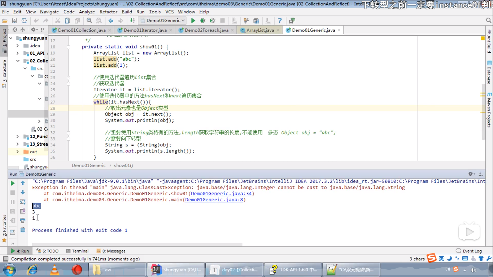

# `NoSuchElementException`

[trace](https://www.bilibili.com/video/BV1uJ411k7wy?p=243)	4min

# `ClassCastException`

[trace](https://www.bilibili.com/video/BV1uJ411k7wy?p=247)	4mim

添加：在该教学中的多态—向下转型（还原）操作中也有

* 接口对象转换错实现类

(类型转换错误)

